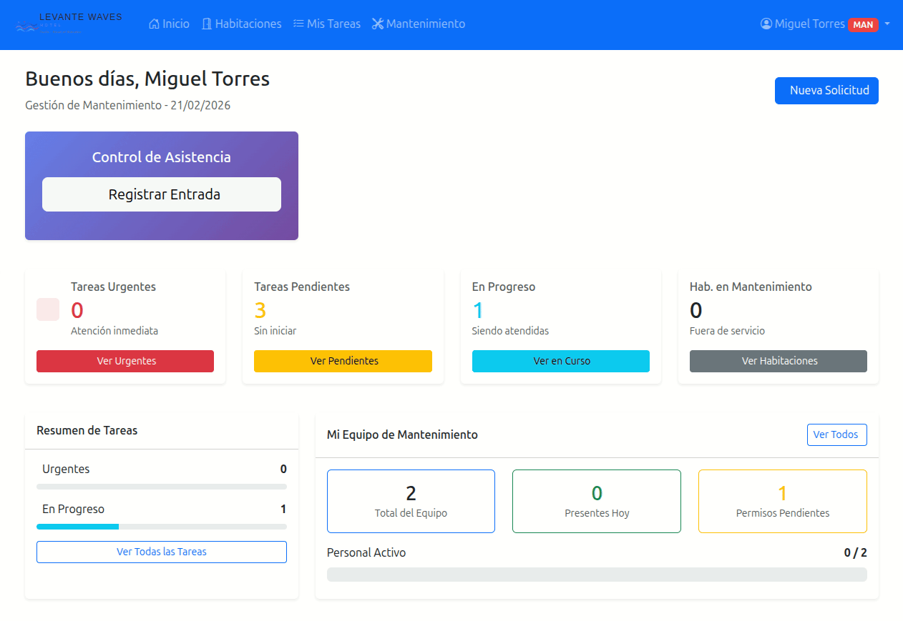
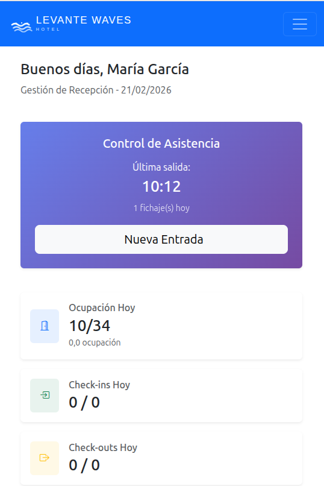
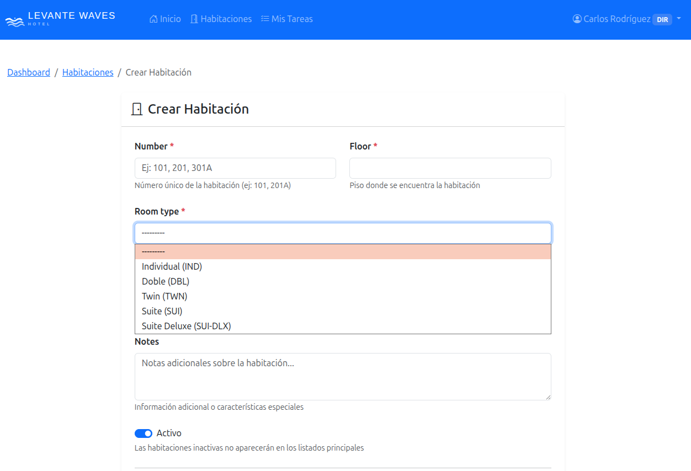
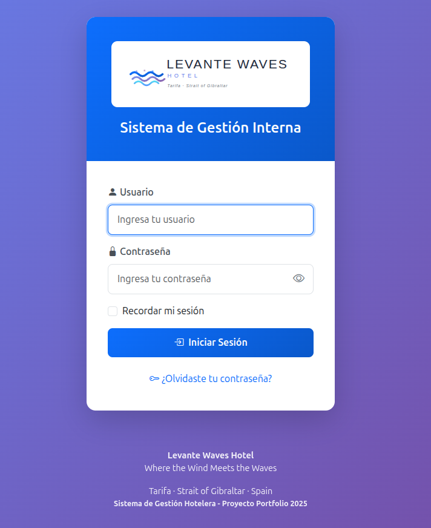

# Levante Waves Hotel - Intranet Management System

A comprehensive Django-based intranet system for hotel operations management, designed to streamline daily workflows across departments including reception, housekeeping, maintenance, and human resources.


## 🚀 Live Demo
<a href="https://intranethotelera.irenemendoza.dev" target="_blank">intranethotelera.irenemendoza.dev</a>

## 🎯 Project Overview

This project was developed as a portfolio piece to demonstrate full-stack development capabilities with Django. It simulates a real-world hotel management system with proper authentication, authorization, and role-based dashboards tailored to different employee types.

**Key Features:**
- 🏨 Complete room management system with real-time status tracking
- 👥 Employee management with role-based permissions
- 📅 Attendance tracking and leave management
- 🧹 Housekeeping task assignment and tracking
- 🔧 Maintenance request workflow
- 📊 Dynamic dashboards adapted to user roles
- 🔐 Secure authentication and authorization system

## 🎥 Quick Check-in Demo



## 📸 Screenshots

### Responsive Dashboard Overview


### Room Form


### Login Page


## 🏗️ Architecture

### Django Apps Structure

```
levante-waves-hotel/
├── apps/
│   ├── attendance/      # Time tracking and attendance records
│   ├── dashboard/       # Role-based dashboards
│   ├── employees/       # Employee and department management
│   ├── leave/          # Leave request and approval system
│   └── rooms/          # Room, cleaning, and maintenance management
├── config/             # Project settings and configuration
├── static/            # CSS, JS, and images
├── templates/         # HTML templates
└── tests/             # Unit tests
```

### Technology Stack

**Backend:**
- Django 6.0+
- SQLite (development) / PostgreSQL (production)
- Django ORM for database operations

**Frontend:**
- Bootstrap 5.3
- Bootstrap Icons
- Vanilla JavaScript
- Chart.js for data visualization

**Development Tools:**
- Python 3.12+
- Git for version control
- Django management commands for data generation

## 🚀 Quick Start

### Prerequisites

- Python 3.12 or higher
- pip (Python package manager)
- Virtual environment (recommended)
- PostgreSQL

### Installation

1. **Clone the repository**
```bash
git clone https://github.com/irenemendoza/levante-waves-hotel.git
cd levante-waves-hotel
```

2. **Create and activate virtual environment**
```bash
# Windows
python -m venv venv
venv\Scripts\activate

# macOS/Linux
python3 -m venv venv
source venv/bin/activate
```

3. **Install dependencies**
```bash
pip install -r requirements.txt
```

4. **Set up environment variables**

Create a `.env` file in the project root:
```env
SECRET_KEY=your-secret-key-here
DEBUG=True
ALLOWED_HOSTS=localhost,127.0.0.1
DB_NAME=hotel_intranet
DB_USER=your_db_user
DB_PASSWORD=your_db_password
DB_HOST=localhost
DB_PORT=5432
```

5. **Run migrations**
```bash
python manage.py migrate
```

6. **Create superuser**
```bash
python manage.py createsuperuser
```

7. **Load sample data (optional but recommended)**

You have two options depending on your needs:

#### Option A: Basic Setup (Quick - Recommended for development)
```bash
python manage.py populate_db
```
Creates minimal data to get started:
- 5 Departments
- 3 Room types
- 15 Rooms
- 8 Demo users

**Demo credentials:**
| Role | Username | Password |
|------|----------|----------|
| Director | `director` | `demo123` |
| Receptionist | `recepcionista1` | `demo123` |
| Housekeeping | `camarera1` | `demo123` |
| Maintenance | `mantenimiento1` | `demo123` |

#### Option B: Full Demo Dataset (Complete - Recommended for presentations)
```bash
python manage.py load_sample_data
```
Creates a realistic hotel simulation with:
- 12 Employees across all departments
- 34 Rooms distributed across 4 floors
- 15 Reservations (past, current, and future)
- ~360 Attendance records (last 30 days)
- 20 Leave requests (approved, pending, rejected)
- 15 Cleaning tasks
- 12 Maintenance tasks

**⚠️ Note:** This command will **clear existing data** (except superusers) before loading sample data.

**Demo credentials:**
| Role | Username | Password |
|------|----------|----------|
| Director | `director` | `demo123` |
| Reception Manager | `jefe.recepcion` | `demo123` |
| Receptionist | `ana.recepcion` | `demo123` |
| Housekeeping Manager | `jefe.limpieza` | `demo123` |
| Housekeeper | `carmen.limpieza` | `demo123` |
| Maintenance Manager | `jefe.mantenimiento` | `demo123` |
| Maintenance Staff | `juan.mantenimiento` | `demo123` |
| HR Manager | `rrhh` | `demo123` |

**💡 Recommendation:** Use `populate_db` for daily development. Use `load_sample_data` when you want to showcase the system with realistic data or take screenshots for documentation.

8. **Run development server**
```bash
python manage.py runserver
```

Visit `http://127.0.0.1:8000` in your browser.

## 👤 User Roles & Access

The system supports multiple employee roles with customized dashboards and permissions:

### Role Hierarchy

| Role | Code | Access Level | Key Permissions |
|------|------|--------------|-----------------|
| **Director** | DIR | Full Access | View all operations, approve high-level decisions |
| **HR Manager** | RRH | HR & Employees | Manage employees, process leave requests |
| **Reception Manager** | JREC | Reception & Rooms | Oversee reception team, room assignments |
| **Receptionist** | REC | Reception | Check-in/out, room status updates |
| **Housekeeping Manager** | JLIM | Housekeeping | Assign cleaning tasks, team management |
| **Housekeeper** | LIM | Housekeeping | Complete cleaning tasks |
| **Maintenance Manager** | JMAN | Maintenance | Assign maintenance tasks, prioritize work |
| **Maintenance Staff** | MAN | Maintenance | Resolve maintenance requests |

### Demo Credentials

After running `load_sample_data`, you can use these credentials:

```
Director:
Username: director
Password: demo123

Reception Manager:
Username: jefe.recepcion
Password: demo123

Receptionist 1:
Username: recepcion1
Password: demo123

Receptionist 2:
Username: recepcion2
Password: demo123

Housekeeper Manager:
Username: jefe.limpieza
Password: demo123

Housekeeper 1:
Username: limpieza1
Password: demo123

Housekeeper 2:
Username: limpieza1
Password: demo123

Housekeeper 3:
Username: limpieza1
Password: demo123

Maintenance Manager:
Username: jefe.mantenimiento
Password: demo123

Maintenance Staff 1:
Username: mantenimiento1
Password: demo123

Maintenance Staff 2:
Username: mantenimiento2
Password: demo123

RRHH:
Username: rrhh
Password: demo123

```

## 🎨 Key Features

### 1. Dashboard System
- **Role-Adaptive UI**: Each role sees relevant information
- **Real-time Statistics**: Live updates on room status, attendance, tasks
- **Quick Actions**: Context-aware buttons for common operations

### 2. Room Management
- **Floor View**: Visual representation of all rooms by floor
- **Status Tracking**: Clean, dirty, occupied, maintenance, out of order
- **Occupancy Management**: Vacant, occupied, reserved states
- **Room Types**: Configurable room categories with amenities

### 3. Attendance System
- **Check-in/Check-out**: Employee time tracking
- **Late Arrival Detection**: Automatic status assignment
- **Work Hours Calculation**: Daily and monthly summaries
- **Attendance History**: Filterable records with statistics

### 4. Leave Management
- **Request Submission**: Employees can request time off
- **Approval Workflow**: Supervisors review and approve/reject
- **Leave Types**: Vacation, sick leave, personal, unpaid
- **Balance Tracking**: Days used vs. available

### 5. Housekeeping Module
- **Task Assignment**: Assign rooms to housekeepers
- **Cleaning Types**: Checkout, stay-over, deep cleaning
- **Priority System**: Urgent tasks flagged
- **Progress Tracking**: Pending, in-progress, completed statuses
- **Photo Documentation**: Upload before/after photos

### 6. Maintenance System
- **Request Creation**: Report maintenance issues
- **Priority Levels**: Low, medium, high, urgent
- **Assignment Workflow**: Assign to maintenance staff
- **Status Tracking**: From pending to completed
- **Resolution Documentation**: Record how issues were resolved

### 7. Employee Management
- **Department Organization**: Group employees by department
- **Profile System**: Avatar, bio, contact information
- **Team Views**: Supervisors see their team members
- **Availability Status**: Track who's available for assignments

## 📊 Database Schema

### Core Models

**Employee**
- Links to Django User model
- Department and role assignment
- Availability tracking
- Hire date and employee number

**Attendance**
- Check-in/check-out timestamps
- Status (present, late, absent)
- Duration calculations

**Leave**
- Employee reference
- Leave type and dates
- Approval workflow
- Rejection reasons

**Room**
- Room number and floor
- Room type (foreign key)
- Status and occupancy
- Last cleaned/inspected timestamps

**CleaningTask**
- Room assignment
- Assigned housekeeper
- Cleaning type and priority
- Completion tracking

**MaintenanceTask**
- Room reference
- Priority level
- Assignment and resolution
- Status workflow

## 🧪 Testing

The project includes comprehensive unit tests covering:

- **Core Models**: Reservations, Rooms, Employees, Leave requests
- **Supporting Models**: Departments, Attendance, Cleaning tasks
- **Authentication**: Login, permissions, role-based access control
- **Forms**: Validation and business rule enforcement

### Running Tests
```bash
python manage.py test
```

### Coverage Highlights
- Room availability validation and conflict detection
- Automatic calculations (reservation totals, leave duration)
- Role-based permissions and group assignments

## 🔒 Security Features

- **CSRF Protection**: Django's built-in CSRF middleware
- **Authentication Required**: Login required for all views
- **Role-Based Access Control**: Permission checks on sensitive operations
- **Password Validation**: Strong password requirements
- **SQL Injection Prevention**: Django ORM parameterized queries

## 📱 Responsive Design

The interface is fully responsive and works on:
- Desktop computers (1920px+)
- Laptops (1366px - 1920px)
- Tablets (768px - 1366px)
- Mobile devices (320px - 768px)

## 🛠️ Development Practices

### Git Workflow
- Conventional Commits standard
- Feature branches
- Professional commit history

### Code Quality
- PEP 8 style guide compliance
- Comprehensive docstrings
- Type hints where appropriate
- DRY (Don't Repeat Yourself) principles

### Database Management
- Migrations for all schema changes
- Indexes on frequently queried fields
- Foreign key relationships properly defined
- Cascading deletes handled appropriately

## 📈 Future Enhancements

Potential features for expansion:

- [ ] Reservation system with guest management
- [ ] Financial reporting and invoicing
- [ ] Inventory management for supplies
- [ ] Email notifications for approvals
- [ ] Mobile app for housekeeping staff
- [ ] API endpoints for third-party integrations
- [ ] Advanced analytics and reporting
- [ ] Calendar view for schedules
- [ ] Multi-language support

## ☁️ Deployment
Deployed on a DigitalOcean droplet using:
- **CloudPanel** for server management
- **Nginx** as web server
- **uWSGI** as application server
- **PostgreSQL** as production database
## 🤝 Contributing

This is a portfolio project, but feedback and suggestions are welcome:

1. Fork the repository
2. Create a feature branch (`git checkout -b feature/AmazingFeature`)
3. Commit your changes (`git commit -m 'Add some AmazingFeature'`)
4. Push to the branch (`git push origin feature/AmazingFeature`)
5. Open a Pull Request

## 📝 License

This project is licensed under the MIT License - see the [LICENSE](LICENSE) file for details.

## 👨‍💻 Author

** Irene Mendoza González **
- GitHub: [@irenemendoza](https://github.com/irenemendoza)
- LinkedIn: [Irene Mendoza González](https://linkedin.com/in/irenemendozagonzalez)


## 🙏 Acknowledgments

- Bootstrap team for the excellent CSS framework
- Django community for comprehensive documentation
- Bootstrap Icons for the icon set


## 📞 Contact

For questions or opportunities, please reach out:
- Email: mendozagonzalez.irene@gmail.com
- LinkedIn: [Irene Mendoza González]
- GitHub: [irenemendoza]

---

**Note:** This is a demonstration project created for portfolio purposes. It simulates a real hotel management system but is not connected to an actual hotel operation.
